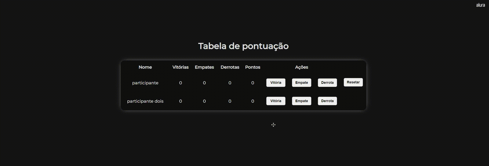

## Tabela de pontuação
Para esse projeto foi desenvolvido uma tabela de classificações, onde o usuário pode administrar os placares dos participantes de um jogo, tendo acesso a vitórias, empates e derrotas. Após a partida o usuário poder ver o tatal de pontos e resetar o placar para uma nova partida.

### :computer: Preview: 

### :sparkles: Tecnologias
Esse projeto foi desenvolvido com as seguintes tecnologias:

  

> Status do projeto: concluído :white_check_mark: